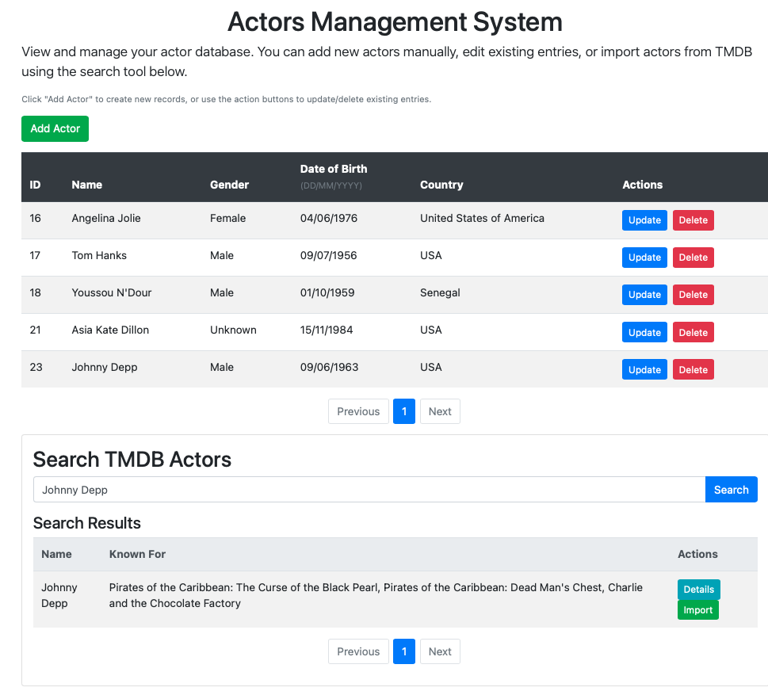

# WSAA Project - Actor Management System



## Overview
This project is part of the Web Services and Applications module for the Data Analytics course at Atlantic Technological University, taught by Andrew Beatty. The Actor Management System is a web application that allows users to:

- Perform CRUD operations on actor records
- Search and import actor data from TMDB (The Movie Database)
- View detailed actor information
- Manage a local database of actors with their attributes

## Live Demo
A live version of this application is hosted on PythonAnywhere:  
🔗 [Actor Management System](https://filipekojak88.pythonanywhere.com/actorviewer.html)

## Features
- **Local Actor Management**:
  - Add, view, update, and delete actor records
  - Paginated display of actors
  - Form validation for data integrity

- **TMDB Integration**:
  - Search for actors in the TMDB database
  - View detailed actor information
  - Import actors from TMDB to local database

- **User Interface**:
  - Responsive design with Bootstrap
  - Interactive forms with client-side validation
  - Modal dialogs for detailed views

## Project Structure
```
WSAA-project/
├── actorDAO.py            # Data Access Object for actor operations
├── actorviewer.html       # Frontend HTML/JS interface
├── dbconfig.py            # Database configuration (ignored in Git)
├── dbconfig_template.py   # Template for database configuration
├── requirements.txt       # Python dependencies
├── server.py              # Flask server and API endpoints
└── tmdb_service.py        # TMDB API service
```

## Functionalities

**actorDAO.py**: 

The class ActorDAO within `actorDAO.py` acts as an intermediary between the Python code and the MySQL database, handling all the database operations for actor records. It follows the DAO (Data Access Object) pattern, which helps keep the database logic separate from the rest of the application [[1]](#1). The class includes standard CRUD operations—create, read (getAll, findByID), update, and delete—allowing users to manage actor data easily. To prevent security risks like SQL injection, the code uses parameterized queries [[2]](#2), ensuring that user input is safely processed. The helper method convertToDictionary transforms database results into Python dictionaries, making the data easier to work with [[3]](#3). The script also manages database connections properly by opening and closing them in getcursor and closeAll, following best practices for resource handling [[4]](#4). Finally, the database credentials are stored separately in dbconfig.py, which improves security and makes the code more maintainable [[5]](#5).

**actorviewer.html**: 

This web application implements a comprehensive web interface for managing actor records through CRUD operations. The application features a dual-interface design: a local actor database with full editing capabilities and integration with The Movie Database (TMDB) API for external data retrieval [[6]](#6). The interface utilizes Bootstrap's responsive grid system and component library [[7]](#7) to present data in paginated tables, with client-side pagination logic [[8]](#8) implemented through jQuery AJAX calls [[9]](#9) that fetch data in chunks of 10 records per page (configurable via the localPerPage variable). This pagination system includes previous/next navigation controls and active page indicators, following established UX patterns for data tables [[10]](#10).

Key technical implementations include: (1) dynamic form handling that toggles between add/edit modes while maintaining state [[11]](#11) [[12]](#12) [[13]](#13), (2) secure data validation through parameterized AJAX requests to prevent injection attacks [[14]](#14) [[2]](#2), (3) locale-aware date formatting using JavaScript's Date object [[15]](#15) to display birthdays in DD/MM/YYYY format, and (4) modal dialogs for TMDB actor details using Bootstrap's modal component [[16]](#16). The TMDB integration implements additional pagination for search results, with API response handling that transforms nested JSON data into readable formats [[17]](#17). All destructive operations employ confirmation dialogs following usability best practices [[18]](#18) [[19]](#19), while error handling provides console feedback for debugging [[20]](#20).

**server.py**:

This Flask server provides the backend for the actor management system, handling all database operations through RESTful API endpoints [[21]](#21). It offers standard CRUD functionality - creating, reading, updating and deleting actor records - with proper error handling for missing data or server issues [[22]](#22). The server includes pagination support for browsing large actor lists [[23]](#23) and integrates with the TMDB API to search and import actor profiles. Security features like CORS headers ensure the API works safely with web frontends [[24]](#24), while presenting a clean route structure (like /actors for all actors and /actors/<id> for specific ones) [[25]](#25).

**tmdb_service.py**:


## Installation Instructions

### Prerequisites
- Python 3.7+
- MySQL database
- PythonAnywhere account (if deploying there)
- TMDB API account

### Setup Steps

1. **Clone the repository**:
   ```bash
   git clone https://github.com/yourusername/WSAA-project.git
   cd WSAA-project
   ```

2. **Set up virtual environment**:
   ```bash
   python -m venv venv
   source venv/bin/activate  # On Windows: venv\Scripts\activate
   ```

3. **Install dependencies**:
   ```bash
   pip install -r requirements.txt
   ```

4. **Database configuration**:
   - Rename `dbconfig_template.py` to `dbconfig.py`
   - For MySQL setup on PythonAnywhere:
     - Follow the guide: [PythonAnywhere MySQL Setup](https://help.pythonanywhere.com/pages/UsingMySQL/)
   - For TMDB API:
     - Register at [TMDB Developer Portal](https://developer.themoviedb.org/docs/getting-started)
     - Get your API key and bearer token
   - Fill in your credentials in `dbconfig.py`

5. **Database setup**:
   - Create a MySQL database with the following tables:
   ```sql
   CREATE TABLE actor (
       id INT AUTO_INCREMENT PRIMARY KEY,
       name VARCHAR(255),
       gender VARCHAR(255),
       dob DATE,
       country VARCHAR(250)
   );
   
   CREATE TABLE country (
       id INT AUTO_INCREMENT PRIMARY KEY,
       name VARCHAR(250) NOT NULL
   );
   ```

6. **Run the application**:
   ```bash
   python server.py
   ```
   The application will be available at `http://localhost:5000/actorviewer.html`

## Deployment to PythonAnywhere

1. Upload all files to your PythonAnywhere account
2. Create a new web app and configure it to use your WSGI file
3. Set up the MySQL database in PythonAnywhere's database tab
4. Configure the virtual environment and install requirements
5. Update the `dbconfig.py` with your PythonAnywhere MySQL credentials

## Security Notes
- The `dbconfig.py` file is included in `.gitignore` to prevent sensitive information from being pushed to GitHub
- Always keep your API keys and database credentials secure
- Use environment variables or configuration management in production environments

## Usage Guide

### Managing Local Actors
- **Add Actor**: Click "Add Actor" button and fill in the form
- **Update Actor**: Click "Update" button on an actor row
- **Delete Actor**: Click "Delete" button on an actor row
- **View All Actors**: The main table displays all actors with pagination controls

### Using TMDB Integration
1. Enter an actor name in the search box
2. Click "Search" to view results from TMDB
3. Click "Details" to view comprehensive actor information
4. Click "Import" to add the actor to your local database

## Troubleshooting
- **Database connection issues**: Verify credentials in `dbconfig.py` and ensure MySQL service is running
- **TMDB API errors**: Check your API key and bearer token, and verify your TMDB account is active
- **Missing dependencies**: Run `pip install -r requirements.txt` to ensure all packages are installed

## Contributing
Contributions are welcome! Drop me an email to filipeferc88@gmail.com and let me know a bit about your contribution and then I can provide to you the SSH of my git repository.

## Acknowledgments
- Andrew Beatty for module instruction
- TMDB for their comprehensive API
- PythonAnywhere for hosting services

## References:
 
<a id="1">[1]</a> GeeksforGeeks (2024a) Data Access Object(DAO) design pattern, GeeksforGeeks. Available at: https://www.geeksforgeeks.org/data-access-object-pattern/ 

<a id="2">[2]</a> SQL injection prevention cheat sheet¶ (no date a) SQL Injection Prevention - OWASP Cheat Sheet Series. Available at: https://cheatsheetseries.owasp.org/cheatsheets/SQL_Injection_Prevention_Cheat_Sheet.html

<a id="3">[3]</a> (No date) How to convert SQL query results into a python dictionary - stack overflow. Available at: https://stackoverflow.com/questions/28755505/how-to-convert-sql-query-results-into-a-python-dictionary

<a id="4">[4]</a> (No date a) What are best practices on managing database connections in .net? - stack overflow. Available at: https://stackoverflow.com/questions/3258788/what-are-best-practices-on-managing-database-connections-in-net 

<a id="5">[5]</a> Chapter 2 guidelines for python developers (no date) MySQL. Available at: https://dev.mysql.com/doc/connector-python/en/connector-python-coding.html

<a id="6">[6]</a> Getting started (no date) The Movie Database (TMDB). Available at: https://developer.themoviedb.org/docs/getting-started 

<a id="7">[7]</a> Mark Otto, J.T. (no date) Get started with bootstrap, · Bootstrap v5.3. Available at: https://getbootstrap.com/docs/5.3/getting-started/introduction/ (Accessed: 24 May 2025). 

<a id="8">[8]</a> Belanger, D. (2024) Implementing pagination for Dynamic Ajax data with JavaScript/jquery, Medium. Available at: https://medium.com/@python-javascript-php-html-css/implementing-pagination-for-dynamic-ajax-data-with-javascript-jquery-09135f43c823 (Accessed: 24 May 2025). 

<a id="9">[9]</a> openjsf.org, O.F.- (no date) Ajax, jQuery Learning Center. Available at: https://learn.jquery.com/ajax/

<a id="10">[10]</a> UXPin (2025a) Table UX best practices: What makes a good data table?, Studio by UXPin. Available at: https://www.uxpin.com/studio/blog/table-ux/ 

<a id="11">[11]</a> Ayebola, J. (2023) Dom manipulation in JavaScript – a comprehensive guide for Beginners, freeCodeCamp.org. Available at: https://www.freecodecamp.org/news/dom-manipulation-in-javascript/

<a id="12">[12]</a> W3schools.com (no date) How To Create a Toggle Switch. Available at: https://www.w3schools.com/howto/howto_css_switch.asp 

<a id="13">[13]</a> Mark Otto, J.T. (no date) Forms, · Bootstrap v5.1. Available at: https://getbootstrap.com/docs/5.1/forms/overview/

<a id="14">[14]</a> Master jQuery Ajax: Complete guide to asynchronous requests (no date) Master jQuery AJAX: Complete Guide to Asynchronous Requests. Available at: https://www.sitepoint.com/use-jquerys-ajax-function/

<a id="15">[15]</a> GeeksforGeeks (2024) Javascript date tolocaledatestring() method, GeeksforGeeks. Available at: https://www.geeksforgeeks.org/javascript-date-tolocaledatestring-method/

<a id="16">[16]</a> Mark Otto, J.T. (no date b) Modal, · Bootstrap. Available at: https://getbootstrap.com/docs/4.0/components/modal/

<a id="17">[17]</a> Jovanovic, M. (2024) How to convert JSON to an HTML table, wpDataTables. Available at: https://wpdatatables.com/json-to-html-table/

<a id="18">[18]</a> Wong, E. (2025) Shneiderman’s eight golden rules will help you design better interfaces, The Interaction Design Foundation. Available at: https://www.interaction-design.org/literature/article/shneiderman-s-eight-golden-rules-will-help-you-design-better-interfaces?srsltid=AfmBOoptPG933oeo5jlrPFaLvMyDM3GtYv9vIAV2G_z7qwa7WrzxuszS#4._dialogue-5

<a id="19">[19]</a> MozDevNet (no date) <dialog>: The dialog element - HTML: Hypertext markup language: MDN</dialog>, MDN Web Docs. Available at: https://developer.mozilla.org/en-US/docs/Web/HTML/Reference/Elements/dialog

<a id="20">[20]</a> Mastering the HTML console (no date) Mastering the HTML Console: Essential Tips for Effective Debugging. Available at: https://www.dhiwise.com/post/mastering-the-html-console-essential-tips-for-debugging 

<a id="21">[21]</a> What is a rest api? (no date) SitePoint. Available at: https://www.sitepoint.com/rest-api/

<a id="22">[22]</a> Wando, H. (2022) How to create a basic CRUD API using python flask, Medium. Available at: https://medium.com/@hillarywando/how-to-create-a-basic-crud-api-using-python-flask-cd68ef5fd7e3

<a id="23">[23]</a> (No date) How to implement pagination in your flask applications for Better User Experience. Available at: https://codymohit.com/how-to-implement-pagination-in-your-flask-applications-for-better-user-experience

<a id="24">[24]</a> Cors (no date) Flask. Available at: https://flask-cors.readthedocs.io/en/latest/

<a id="25">[25]</a> Welcome to flask¶ (no date) Welcome to Flask - Flask Documentation (3.1.x). Available at: https://flask.palletsprojects.com/ (Accessed: 25 May 2025). 